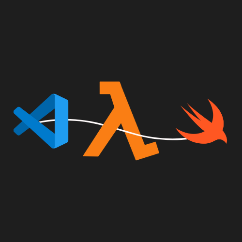

# vscode-aws-lambda-swift

vscode-aws-lambda-swift is a Visual Studio Code extension that simplifies the process of creating, testing, and deploying AWS Lambda functions using Swift. With this extension, you can quickly set up Lambda projects, configure deployment options, and test your functions locally or remotely.

## Features

- **Project Initialization:** Easily create new AWS Lambda projects with customizable settings such as project name, region, and deployment path.
- **Template Selection:** Choose from a variety of templates to kickstart your Lambda project, each providing additional information.
- **Build & Package:** Compile your Swift code and package it into a ZIP archive for deployment to AWS Lambda.
- **Local Testing:** Test your Lambda functions locally using predefined events or custom JSON files to simulate various input scenarios.
- **Deployment:** Deploy your Lambda project to AWS with ease, specifying parameters like stack name and deployment region directly from Visual Studio Code.
- **Remote Testing:** After deployment, test your functions remotely against live AWS resources, ensuring they behave as expected in the cloud environment.

## Requirements

- [Docker](https://www.docker.com/): Install Docker to build and test Swift projects in a containerized environment.
- [AWS CLI](https://docs.aws.amazon.com/cli/latest/userguide/getting-started-install.html): Install the AWS Command Line Interface to interact with AWS services.
- [AWS SAM CLI](https://docs.aws.amazon.com/serverless-application-model/latest/developerguide/serverless-sam-cli-install.html): Install the AWS Serverless Application Model CLI for building and deploying serverless applications.

## Getting Started

1. **Install the Extension:** Search for `VSCode AWS Lambda Swift` in the Visual Studio Code Extensions Marketplace and install it. Or click [here](https://marketplace.visualstudio.com/items?itemName=MarwaneKoutar.vscode-aws-lambda-swift) to download the extension.
2. **Configure AWS Credentials:** Set up your AWS credentials using the AWS CLI by running `aws configure` in your terminal. Make sure you have the necessary permissions to create and manage Lambda functions.
3. **Start the Extension:** Open Visual Studio Code, press `Command+Shift+P` to open the command palette, and select `AWS Lambda Swift: Open AWS Lambda Swift Dashboard`. This will open the main panel of the extension.
4. **You're Ready to Go!** Start creating, testing, and deploying AWS Lambda functions using Swift with the help of this extension.

## Feedback & Contributions

If you encounter any issues or have suggestions for improvement, please feel free to [submit an issue](https://github.com/MarwaneKoutar/vscode-aws-lambda-swift/issues) on GitHub. Contributions are also welcome and appreciated!

## License

This project is licensed under the MIT License. See the [LICENSE](./vscode-extension/LICENSE.md) file for more information.
